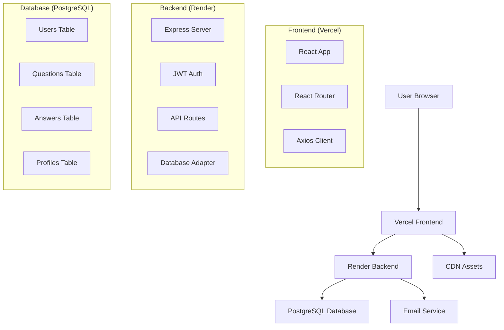

# 🌟 Evangadi Forum-2025

> A modern, full-stack Q&A platform built with React and Node.js, empowering communities to share knowledge and grow together.

[](https://evangadi-forum-frontend-rho.vercel.app)
[](https://evangadi-forum-backend-skqo.onrender.com)
[](https://opensource.org/licenses/MIT)
[](https://nodejs.org/)
[](https://postgresql.org/)

## 📖 Table of Contents

- [🎯 Overview](#-overview)
- [✨ Features](#-features)
- [🛠️ Tech Stack](#️-tech-stack)
- [🚀 Live Demo](#-live-demo)
- [📸 Screenshots](#-screenshots)
- [🏗️ Architecture](#️-architecture)
- [⚙️ Installation](#️-installation)
- [🔧 Configuration](#-configuration)
- [📱 Usage](#-usage)
- [🔐 Authentication](#-authentication)
- [📊 Database Schema](#-database-schema)
- [🌐 API Documentation](#-api-documentation)
- [🚀 Deployment](#-deployment)
- [🤝 Contributing](#-contributing)
- [📄 License](#-license)
- [👨‍💻 Author](#-author)

## 🎯 Overview

**Evangadi Forum** is a comprehensive Q&A platform designed to facilitate knowledge sharing within communities. Built with modern web technologies, it provides a seamless experience for users to ask questions, share answers, and engage in meaningful discussions.

### 🌟 Key Highlights

- 🔒 **Secure Authentication** with JWT tokens
- 📱 **Responsive Design** that works on all devices
- ⚡ **Real-time Updates** for dynamic user experience
- 🔍 **Advanced Search** functionality
- 👥 **User Management** with profiles and activity tracking
- 📧 **Email Integration** for password reset and notifications
- 🛡️ **Data Validation** and security measures
- 📊 **Analytics Ready** for community insights

## ✨ Features

### 🔐 User Authentication
- ✅ **Secure Registration** with email validation
- ✅ **JWT-based Login** system
- ✅ **Password Reset** via email
- ✅ **Protected Routes** for authenticated users
- ✅ **Session Management** with automatic logout

### 💬 Community Features
- ✅ **Ask Questions** with rich text formatting
- ✅ **Provide Answers** to help community members
- ✅ **Search Questions** with keyword filtering
- ✅ **User Profiles** with activity history
- ✅ **Question Categories** and tagging system
- ✅ **Pagination** for better performance

### 🎨 User Experience
- ✅ **Responsive Design** for mobile and desktop
- ✅ **Intuitive Navigation** with clean UI
- ✅ **Loading States** and error handling
- ✅ **Form Validation** with helpful feedback
- ✅ **Accessibility** features for all users

### 🛡️ Security & Performance
- ✅ **Data Encryption** and secure storage
- ✅ **Rate Limiting** to prevent abuse
- ✅ **Input Sanitization** against XSS attacks
- ✅ **CORS Protection** for secure API access
- ✅ **Database Optimization** for fast queries

## 🛠️ Tech Stack

### Frontend
- ⚛️ **React 18** - Modern UI library
- 🎨 **CSS3** - Responsive styling
- 🌐 **Axios** - HTTP client for API calls
- 🔀 **React Router** - Client-side routing
- 📱 **Responsive Design** - Mobile-first approach

### Backend
- 🟢 **Node.js** - JavaScript runtime
- 🚀 **Express.js** - Web application framework
- 🔐 **JWT** - JSON Web Tokens for authentication
- 📧 **Nodemailer** - Email service integration
- 🛡️ **bcrypt** - Password hashing
- ⚡ **Express Rate Limit** - API protection

### Database
- 🐘 **PostgreSQL** - Robust relational database
- 🔄 **Database Adapter** - MySQL/PostgreSQL compatibility
- 📊 **Optimized Queries** - Efficient data retrieval
- 🔒 **Data Integrity** - ACID compliance

### Deployment & DevOps
- ☁️ **Render** - Backend hosting
- ⚡ **Vercel** - Frontend hosting
- 🌍 **CDN** - Global content delivery
- 🔄 **CI/CD** - Automated deployments
- 📊 **Environment Management** - Secure configuration

## 🚀 Live Demo

### 🌐 **Frontend**: [evangadi-forum-frontend-rho.vercel.app](https://evangadi-forum-frontend-rho.vercel.app)
### 🔗 **Backend API**: [evangadi-forum-backend-skqo.onrender.com](https://evangadi-forum-backend-skqo.onrender.com)

> **Test Account**: Feel free to create a new account or use the demo features!

## 📸 Screenshots

### 🏠 Homepage

*Clean, intuitive interface showcasing recent questions and community activity*

### 🔐 Authentication

*Secure login system with JWT authentication*

### 💬 Question & Answers

*Interactive Q&A interface with rich text support*

### 📱 Mobile Responsive

*Fully responsive design that works perfectly on mobile devices*

## 🏗️ Architecture



### 🔄 Data Flow
1. **User Interaction** → Frontend (React)
2. **API Requests** → Backend (Express.js)
3. **Authentication** → JWT Verification
4. **Database Operations** → PostgreSQL
5. **Response** → JSON API Response
6. **UI Update** → React State Management

## ⚙️ Installation

### 📋 Prerequisites
- 🟢 **Node.js** (v18 or higher)
- 📦 **npm** or **yarn**
- 🐘 **PostgreSQL** (for local development)
- 📧 **Gmail account** (for email features)

### 🚀 Quick Start

#### 1️⃣ Clone the Repository
```bash
git clone https://github.com/your-username/evangadi-forum.git
cd evangadi-forum
```

#### 2️⃣ Install Dependencies

**Backend Setup:**
```bash
cd server
npm install
```

**Frontend Setup:**
```bash
cd ../client
npm install
```

#### 3️⃣ Environment Configuration

**Backend (.env in /server):**
```env
# Database Configuration
DB_TYPE=postgres
POSTGRES_HOST=localhost
POSTGRES_PORT=5432
POSTGRES_USER=your_username
POSTGRES_PASSWORD=your_password
POSTGRES_DB=evangadi_forum

# Application Settings
PORT=3002
NODE_ENV=development
INIT_DB=true

# Authentication
JWT_SECRET=your_super_secret_jwt_key_here
JWT_EXPIRES_IN=30d
SALT_ROUNDS=12

# Email Configuration
EMAIL_USER=your_email@gmail.com
EMAIL_APP_PASSWORD=your_gmail_app_password

# Frontend URL
FRONTEND_URL=http://localhost:5173
```

**Frontend (.env in /client):**
```env
VITE_API_BASE_URL=http://localhost:3002/api
```

#### 4️⃣ Database Setup
```bash
# Start PostgreSQL service
sudo service postgresql start

# Create database
createdb evangadi_forum

# Tables will be created automatically when you start the server
```

#### 5️⃣ Start Development Servers

**Backend:**
```bash
cd server
npm run dev
```

**Frontend:**
```bash
cd client
npm run dev
```

#### 6️⃣ Access the Application
- 🌐 **Frontend**: http://localhost:5173
- 🔗 **Backend API**: http://localhost:3002
- 📊 **Database**: PostgreSQL on localhost:5432

## 🔧 Configuration

### 🗄️ Database Configuration

The application uses a **Database Adapter** that supports both MySQL and PostgreSQL:

```javascript
// Switch between databases easily
DB_TYPE=mysql     // For MySQL
DB_TYPE=postgres  // For PostgreSQL
```

### 📧 Email Configuration

Set up Gmail SMTP for password reset emails:

1. **Enable 2-Factor Authentication** on your Gmail account
2. **Generate App Password**: Google Account → Security → App passwords
3. **Use App Password** in EMAIL_APP_PASSWORD environment variable

### 🔐 JWT Configuration

```env
# Generate a strong JWT secret (64+ characters recommended)
JWT_SECRET=your_super_long_and_random_secret_key_for_jwt_tokens_here
JWT_EXPIRES_IN=30d  # Token expiration time
```

### 🛡️ Security Headers

The application includes security middleware:
- ✅ **CORS Protection**
- ✅ **Rate Limiting**
- ✅ **Helmet.js** security headers
- ✅ **Input Validation**
- ✅ **XSS Protection**

## 📱 Usage

### 🔐 Getting Started

1. **Register Account**: Create a new account with email verification
2. **Login**: Access your account with secure authentication
3. **Ask Questions**: Share your questions with the community
4. **Provide Answers**: Help others by sharing your knowledge
5. **Search**: Find relevant questions using the search functionality

### 👥 User Roles

- **🙋 Regular Users**: Can ask questions, provide answers, and manage their profile
- **🛡️ Moderators**: (Future feature) Can moderate content and manage users
- **👑 Administrators**: (Future feature) Full system access and management

### 🔍 Search Functionality

```javascript
// Search examples
"How to deploy React app"          // Keyword search
"javascript functions"             // Topic-based search
"database optimization"            // Technical queries
```

## 🔐 Authentication

### 🔑 JWT Token Flow

1. **User Registration/Login** → Server validates credentials
2. **JWT Token Generated** → Includes user ID, username, email
3. **Token Sent to Client** → Stored securely in localStorage
4. **Authenticated Requests** → Token included in Authorization header
5. **Token Validation** → Server verifies token on each request

### 🛡️ Security Features

- ✅ **Password Hashing** with bcrypt (12 rounds)
- ✅ **JWT Expiration** (30 days default)
- ✅ **Automatic Logout** on token expiration
- ✅ **Secure Headers** for API requests
- ✅ **Rate Limiting** to prevent brute force attacks

### 📧 Password Reset Flow

1. **Request Reset** → User enters email address
2. **Generate Token** → Secure random token created
3. **Send Email** → Reset link sent to user's email
4. **Verify Token** → User clicks link, token validated
5. **Reset Password** → User sets new password
6. **Confirmation** → Success email sent

## 📊 Database Schema

### 👥 Users Table
```sql
CREATE TABLE users (
    user_id SERIAL PRIMARY KEY,
    username VARCHAR(50) UNIQUE NOT NULL,
    first_name VARCHAR(50) NOT NULL,
    last_name VARCHAR(50) NOT NULL,
    email VARCHAR(100) UNIQUE NOT NULL,
    password VARCHAR(255) NOT NULL,
    reset_token VARCHAR(255),
    reset_token_expires TIMESTAMP,
    created_at TIMESTAMP DEFAULT CURRENT_TIMESTAMP,
    updated_at TIMESTAMP DEFAULT CURRENT_TIMESTAMP
);
```

### ❓ Questions Table
```sql
CREATE TABLE questions (
    question_id SERIAL PRIMARY KEY,
    user_id INTEGER REFERENCES users(user_id),
    title VARCHAR(100) NOT NULL,
    question VARCHAR(100) NOT NULL,
    description VARCHAR(255) NOT NULL,
    tag VARCHAR(100),
    time TIMESTAMP DEFAULT CURRENT_TIMESTAMP
);
```

### 💬 Answers Table
```sql
CREATE TABLE answers (
    answer_id SERIAL PRIMARY KEY,
    question_id INTEGER REFERENCES questions(question_id),
    user_id INTEGER REFERENCES users(user_id),
    answer TEXT NOT NULL,
    time TIMESTAMP DEFAULT CURRENT_TIMESTAMP
);
```

### 👤 Profiles Table
```sql
CREATE TABLE profiles (
    user_profile_id SERIAL PRIMARY KEY,
    user_id INTEGER UNIQUE REFERENCES users(user_id),
    profile_picture VARCHAR(255),
    phone VARCHAR(20),
    date_of_birth DATE,
    created_at TIMESTAMP DEFAULT CURRENT_TIMESTAMP
);
```

## 🌐 API Documentation

### 🔐 Authentication Endpoints

#### Register User
```http
POST /api/auth/register
Content-Type: application/json

{
  "username": "johndoe",
  "first_name": "John",
  "last_name": "Doe",
  "email": "john@example.com",
  "password": "securepassword123"
}
```

#### Login User
```http
POST /api/auth/login
Content-Type: application/json

{
  "email": "john@example.com",
  "password": "securepassword123"
}
```

#### Check User (Protected)
```http
GET /api/auth/checkUser
Authorization: Bearer <jwt_token>
```

### ❓ Questions Endpoints

#### Get All Questions
```http
GET /api/questions?page=1&limit=10&search=javascript
```

#### Get Question by ID
```http
GET /api/questions/123
```

#### Create Question (Protected)
```http
POST /api/questions
Authorization: Bearer <jwt_token>
Content-Type: application/json

{
  "title": "How to deploy React app?",
  "question": "Need help with deployment",
  "description": "I'm trying to deploy my React app...",
  "tag": "deployment"
}
```

#### Update Question (Protected)
```http
PATCH /api/questions/123
Authorization: Bearer <jwt_token>
```

#### Delete Question (Protected)
```http
DELETE /api/questions/123
Authorization: Bearer <jwt_token>
```

### 💬 Answers Endpoints

#### Get Answers for Question
```http
GET /api/answers/123
```

#### Post Answer (Protected)
```http
POST /api/answers
Authorization: Bearer <jwt_token>
Content-Type: application/json

{
  "question_id": 123,
  "answer": "You can deploy using Vercel..."
}
```

### 📧 Password Reset Endpoints

#### Request Password Reset
```http
POST /api/auth/forgot-password
Content-Type: application/json

{
  "email": "john@example.com"
}
```

#### Verify Reset Token
```http
GET /api/auth/verify-token/abc123token
```

#### Reset Password
```http
POST /api/auth/reset-password/abc123token
Content-Type: application/json

{
  "password": "newpassword123",
  "confirmPassword": "newpassword123"
}
```

## 🚀 Deployment

### ☁️ Backend Deployment (Render)

1. **Create PostgreSQL Database** on Render
2. **Create Web Service** connected to your GitHub repo
3. **Configure Environment Variables**:
   ```env
   DB_TYPE=postgres
   POSTGRES_HOST=<render-postgres-host>
   POSTGRES_USER=<render-postgres-user>
   POSTGRES_PASSWORD=<render-postgres-password>
   POSTGRES_DB=<render-postgres-db>
   NODE_ENV=production
   JWT_SECRET=<your-jwt-secret>
   EMAIL_USER=<your-email>
   EMAIL_APP_PASSWORD=<your-app-password>
   FRONTEND_URL=<your-vercel-url>
   ```
4. **Deploy** automatically from GitHub

### ⚡ Frontend Deployment (Vercel)

1. **Connect GitHub Repository** to Vercel
2. **Set Root Directory**: `client`
3. **Configure Environment Variables**:
   ```env
   VITE_API_BASE_URL=<your-render-backend-url>/api
   ```
4. **Deploy** automatically from GitHub

### 🔄 Continuous Deployment

- ✅ **Automatic Deployment** on git push
- ✅ **Environment-specific** configurations
- ✅ **Health Checks** and monitoring
- ✅ **Rollback** capabilities

## 🧪 Testing

### 🛠️ Development Testing
```bash
# Backend tests
cd server
npm test

# Frontend tests
cd client
npm test
```

### 🌐 API Testing
```bash
# Test backend health
curl https://your-backend.onrender.com/api/questions

# Test with authentication
curl -H "Authorization: Bearer <token>" \
     https://your-backend.onrender.com/api/auth/checkUser
```

## 📈 Performance Optimization

### ⚡ Frontend Optimizations
- ✅ **Code Splitting** with React.lazy()
- ✅ **Image Optimization** and lazy loading
- ✅ **Caching Strategies** for API responses
- ✅ **Bundle Optimization** with Vite

### 🗄️ Backend Optimizations
- ✅ **Database Indexing** for faster queries
- ✅ **Connection Pooling** for PostgreSQL
- ✅ **Rate Limiting** for API protection
- ✅ **Gzip Compression** for responses

## 🔒 Security Measures

### 🛡️ Application Security
- ✅ **JWT Authentication** with secure tokens
- ✅ **Password Hashing** with bcrypt
- ✅ **Input Validation** and sanitization
- ✅ **CORS Configuration** for API access
- ✅ **Rate Limiting** to prevent abuse
- ✅ **XSS Protection** with proper escaping
- ✅ **SQL Injection Prevention** with parameterized queries

### 📧 Email Security
- ✅ **App Passwords** instead of account passwords
- ✅ **Secure SMTP** connections
- ✅ **Token-based** password reset
- ✅ **Time-limited** reset tokens (30 minutes)

## 🤝 Contributing

We welcome contributions from the community! Here's how you can help:

### 🌟 Ways to Contribute
- 🐛 **Bug Reports**: Report issues you encounter
- 💡 **Feature Requests**: Suggest new features
- 📝 **Documentation**: Improve documentation
- 💻 **Code Contributions**: Submit pull requests
- 🧪 **Testing**: Help test new features

### 📋 Contribution Guidelines

1. **Fork** the repository
2. **Create** a feature branch (`git checkout -b feature/amazing-feature`)
3. **Commit** your changes (`git commit -m 'Add amazing feature'`)
4. **Push** to the branch (`git push origin feature/amazing-feature`)
5. **Open** a Pull Request

### 🏗️ Development Setup
```bash
# Fork and clone the repo
git clone https://github.com/your-username/evangadi-forum.git

# Create a new branch
git checkout -b feature/your-feature-name

# Make your changes and test

# Commit with a descriptive message
git commit -m "Add: your feature description"

# Push to your fork
git push origin feature/your-feature-name

# Create a Pull Request
```

### 📝 Code Style
- ✅ **ESLint** configuration for consistent coding style
- ✅ **Prettier** for code formatting
- ✅ **Meaningful** commit messages
- ✅ **Comprehensive** comments for complex logic

## 🐛 Known Issues

- ⚠️ **Mobile Safari**: Minor styling issues on iOS Safari (v15.x)
- ⚠️ **Email Delivery**: Gmail may mark emails as spam (first-time setup)
- ⚠️ **Slow Cold Starts**: Render free tier has cold start delays

## 🔮 Future Enhancements

### 📋 Planned Features
- 🔔 **Real-time Notifications** with WebSocket
- 👍 **Voting System** for questions and answers
- 🏷️ **Advanced Tagging** and categorization
- 📊 **User Reputation** system
- 🔍 **Advanced Search** with filters
- 📱 **Mobile App** with React Native
- 🤖 **AI-powered** question suggestions
- 📈 **Analytics Dashboard** for admins

### 🛠️ Technical Improvements
- ⚡ **Redis Caching** for better performance
- 🔄 **Real-time Updates** with Socket.io
- 📊 **Elasticsearch** for advanced search
- 🐳 **Docker** containerization
- 🧪 **Automated Testing** with Jest/Cypress
- 📊 **Monitoring** with application insights


## 📄 License

This project is licensed under the **MIT License** - see the [LICENSE](LICENSE) file for details.

```
MIT License

Copyright (c) 2024 Evangadi Forum

Permission is hereby granted, free of charge, to any person obtaining a copy
of this software and associated documentation files (the "Software"), to deal
in the Software without restriction, including without limitation the rights
to use, copy, modify, merge, publish, distribute, sublicense, and/or sell
copies of the Software, and to permit persons to whom the Software is
furnished to do so, subject to the following conditions:

The above copyright notice and this permission notice shall be included in all
copies or substantial portions of the Software.

THE SOFTWARE IS PROVIDED "AS IS", WITHOUT WARRANTY OF ANY KIND, EXPRESS OR
IMPLIED, INCLUDING BUT NOT LIMITED TO THE WARRANTIES OF MERCHANTABILITY,
FITNESS FOR A PARTICULAR PURPOSE AND NONINFRINGEMENT. IN NO EVENT SHALL THE
AUTHORS OR COPYRIGHT HOLDERS BE LIABLE FOR ANY CLAIM, DAMAGES OR OTHER
LIABILITY, WHETHER IN AN ACTION OF CONTRACT, TORT OR OTHERWISE, ARISING FROM,
OUT OF OR IN CONNECTION WITH THE SOFTWARE OR THE USE OR OTHER DEALINGS IN THE
SOFTWARE.
```

## 👨‍💻 Author

**Your Name**
- 🌐 **Portfolio**: [amanuelwubneh.com](https://amanuelwubneh.com/)
- 💼 **LinkedIn**: [amanuel-wubneh](https://www.linkedin.com/in/amanuel-wubneh-816606309/)
- 🐙 **GitHub**: [@AMETIY](https://github.com/AMETIY)

## 🙏 Acknowledgments

- 🎓 **Evangadi Tech** - For the inspiration and learning opportunity
- ⚛️ **React Team** - For the amazing frontend framework
- 🟢 **Node.js Community** - For the robust backend platform
- 🐘 **PostgreSQL** - For the reliable database system
- 🌐 **Open Source Community** - For the countless libraries and tools
- 👥 **Beta Testers** - For valuable feedback and bug reports

## 📌 Notes
This is a practice project built to learn full-stack integration and improve React + Node.js skills.

## 📊 Project Stats


---

<div align="center">

### 🌟 **Star this repo if you found it helpful!** 🌟

**Made with ❤️ by [Amanuel Wubneh](https://github.com/AMETIY)**

</div>
